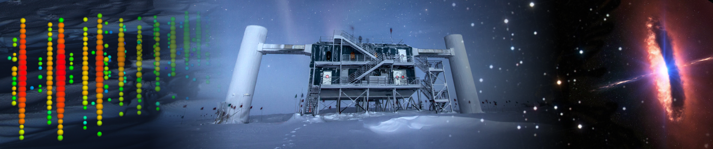

# IceCube - Neutrinos in Deep Ice

This is my notebook for the Neutrino in deep ice challenge

It is a competition from Kaggle that aims to identify the direction from which neutrinos detected by the IceCube neutrino observatory came. The purpose of this task is to help partner observatories limit their search space and associate neutrinos with sources like supernovae or gamma-ray bursts. The challenge is to process a large number of events quickly and accurately.

## Dataset

The dataset is divided into training and testing sets, stored in Parquet format, and contains the following files:

* [train/test]_meta.parquet: Contains metadata for the events, including event ID, batch ID, and first/last pulse index. The target variables are the azimuth and zenith angles.

* [train/test]/batch_[n].parquet: Each batch contains tens of thousands of events. Each event may have thousands of pulses, which are the digitized output from photomultiplier tubes. The pulses' data include event ID, time, sensor ID, charge, and an auxiliary flag.

* sample_submission.parquet: An example submission file with the correct columns and properly ordered event IDs. The final submission must be in CSV format.

* sensor_geometry.csv: Provides the x, y, and z positions for each of the 5160 IceCube sensors in meters, with the origin at the center of the IceCube detector. The coordinate system is right-handed, and the z-axis points upwards when standing at the South Pole. Azimuth and zenith angles can be calculated from these coordinates.

Example event image, a visual representation of the features of an IceCube event in the dataset. 
The colorful dots represent sensors that logged at least one pulse, with the size of the dots corresponding to the total charge of all pulses and the color indicating the time of the first pulse.

<done>